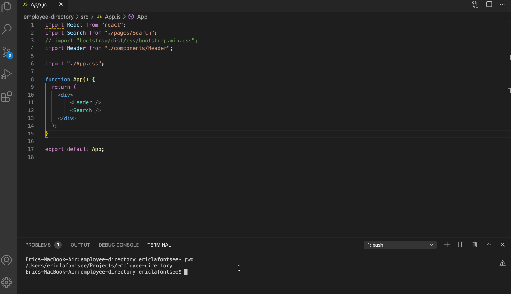

# Employee-Directory

## Description
For this project, I created an employee directory with React. The user can search   
any employee by first or last name. The search will filter the user's results and return   
the search employee's picture, name, email, and phone number.

## Table Of Contents
* [Usage](#Usage)
* [Prerequisites](#Prerequisites)
* [Installation](#Installation)
* [BuiltWith](#Built-With)
* [License](#License)
* [Author](#Author)
* [Questions](#Questions)
* [Acknowledgments](#Acknowledgments )

## Usage



## Prerequisites
To build or edit this application, you will need VS Code, or any editor, as well as node.js installed.

## Installation
* When you first set up the project, open up the integrated terminal in VS Code and navigate to the root directory of your project. Then enter the following into your terminal:  
```npx create-react-app employee-directory ```
* Make sure you install the gh-pages npm package by running the following command in the terminal:  
```npm install --save gh-pages```
* To install axios for your API requests, enter the following into your terminal:  
```npm install --save axios```
* In your package.json, add the following field with your github username and project name:  
```"homepage": "https://myusername.github.io/my-app"```
* In your package.json, add the following scripts:  
   ```"predeploy": "npm run build", "deploy": "gh-pages -d build"```
* To deploy the project, run :  
   ```npm run deploy```
* To start the app, run :  
   ```npm start```
* The API query URL that will generate the employee list:  
   ```"https://randomuser.me/api/?results=200&nat=us"```


## Built-With
React
Node.js  
JavaScript   
HTML  
CSS  
Bootstrap

## License 
This project is licensed under MIT. 


## Author
Eric LaFontsee 

## Questions
If you have any additional questions you can contact me here:  
GitHub: https://github.com/ericlafontsee   
elafontsee@gmail.com

## Acknowledgments 
* Sangeetha Kaliaperumal - Trilogy  
    * Worked with me to set up the project
* Anthony Cooper - Trilogy  
    * Worked with me on the filtering function 


 


